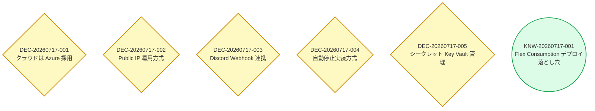

# ドキュメントグラフ

> このファイルは `doc-manager` エージェントが自動生成します。手動編集しないこと。

## ドキュメント一覧

### 意思決定

| ID | タイトル | ステータス |
|----|---------|----------|
| [DEC-20260717-001](decisions/DEC-20260717-001.md) | クラウドは Azure 採用 | accepted |
| [DEC-20260717-002](decisions/DEC-20260717-002.md) | Public IP 運用方式 | accepted |
| [DEC-20260717-003](decisions/DEC-20260717-003.md) | Discord Webhook 連携 | accepted |
| [DEC-20260717-004](decisions/DEC-20260717-004.md) | 自動停止実装方式 | accepted |
| [DEC-20260717-005](decisions/DEC-20260717-005.md) | シークレット Key Vault 管理 | accepted |

### ナレッジ

| ID | タイトル |
|----|---------|
| [KNW-20260717-001](knowledge/KNW-20260717-001.md) | Flex Consumption デプロイ落とし穴 |

---

## エンティティ統計

- **意思決定**: 5個
- **ナレッジ**: 1個
